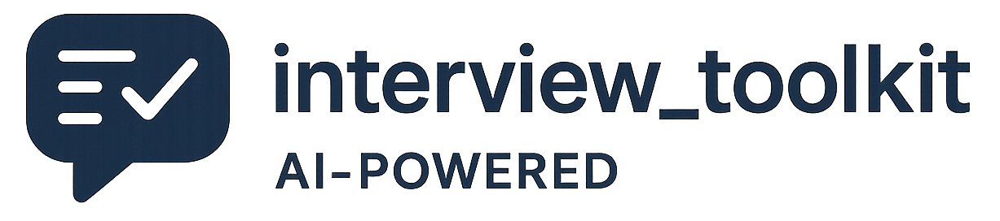

# Interview Toolkit

<p align="center">
  
</p>

Generate interview questions with AI and export them as beautiful PDFs. Perfect for interviewers, candidates, and educators.

[](LICENSE)
[](https://www.python.org/downloads/)

## Features

- AI-powered question generation (OpenAI or Ollama)
- Professional PDF exports with multiple themes
- JSON storage for question sets
- Batch processing for efficient generation

> **Note:** OpenAI API integration is not fully tested in production. We use Ollama for our development and testing.

## Installation

```bash
# Clone the repository
git clone https://github.com/GM-Sunshine/interview_toolkit.git
cd interview-toolkit

# Run the installation script
./install.py

# For development setup
./install.py --dev
```

## Configuration

Copy the example environment file and edit with your settings:

```bash
cp .env.example .env
```

Key settings:
- `API_TYPE`: Choose 'openai' or 'ollama'
- `OPENAI_API_KEY`: Your OpenAI API key (if using OpenAI)
- `OLLAMA_BASE_URL`: URL for Ollama API (default: http://localhost:11434)

## Usage

### Interactive Mode

```bash
python interview_toolkit.py
```

### Command Line Options

```bash
# Generate new questions
python interview_toolkit.py --generate

# Create PDF from existing questions
python interview_toolkit.py --pdf

# List available question sets
python interview_toolkit.py --list

# Enable debug mode
python interview_toolkit.py --debug
```

## Contributing

Contributions are welcome! See [CONTRIBUTING.md](CONTRIBUTING.md) for details.

## License

This project is licensed under the MIT License - see the [LICENSE](LICENSE) file for details.
